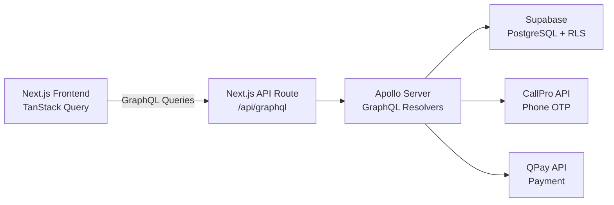
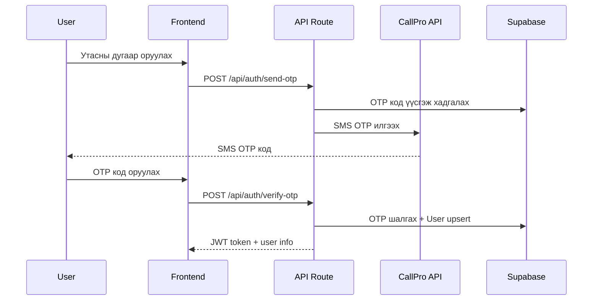
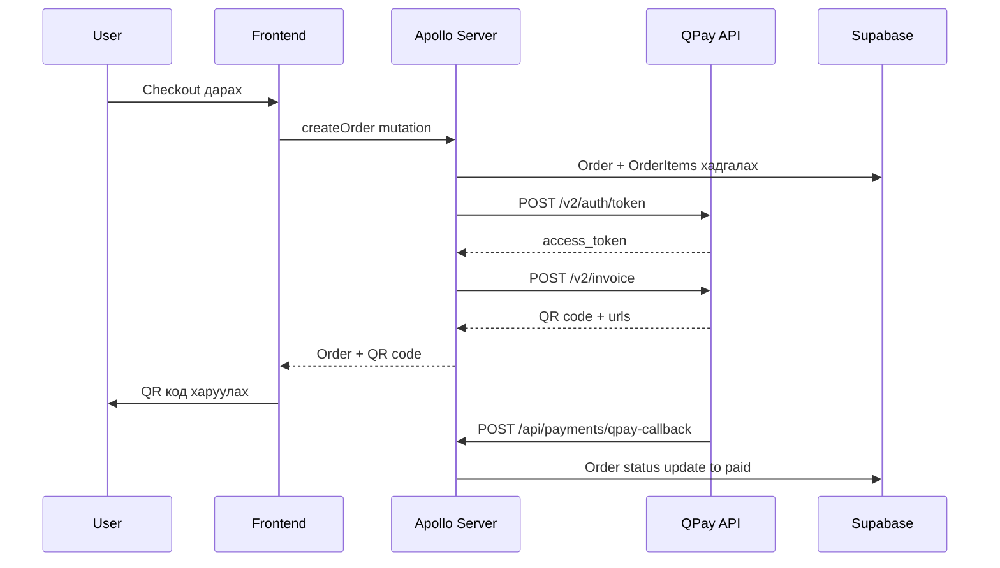

# Multi-Tenant Онлайн Номын Худалдааны SaaS

## Архитектурын ерөнхий бүтэц



## Технологийн стек

| Layer | Technology |

|-------|-----------|

| Framework | Next.js 14 (App Router) |

| Frontend Data | TanStack Query + graphql-request |

| Backend API | Apollo Server (Next.js Route Handler) |

| Database | Supabase PostgreSQL |

| Multi-tenancy | Shared DB + tenant_id + RLS |

| Auth | CallPro OTP + Supabase Auth (custom JWT) |

| Payment | QPay Mongolia |

| Styling | Tailwind CSS |

## Төслийн бүтэц

```
src/
  app/
    (storefront)/
      [tenant]/            -- Tenant slug-аар dynamic route
        page.tsx            -- Нүүр хуудас
        books/
          page.tsx          -- Номын жагсаалт
          [id]/page.tsx     -- Номын дэлгэрэнгүй
        cart/page.tsx       -- Сагс
        checkout/page.tsx   -- Төлбөр төлөх
        orders/page.tsx     -- Захиалгын түүх
    (auth)/
      login/page.tsx        -- Утасны дугаараар нэвтрэх
      verify/page.tsx       -- OTP баталгаажуулах
    (admin)/
      [tenant]/
        dashboard/page.tsx  -- Admin dashboard
        books/page.tsx      -- Ном удирдах
        orders/page.tsx     -- Захиалга удирдах
    api/
      graphql/route.ts      -- Apollo Server endpoint
      auth/
        send-otp/route.ts   -- CallPro OTP илгээх
        verify-otp/route.ts -- OTP баталгаажуулах
      payments/
        qpay-callback/route.ts -- QPay callback
  lib/
    supabase/
      client.ts             -- Supabase client
      admin.ts              -- Supabase service role client
    graphql/
      schema.ts             -- GraphQL type definitions
      resolvers/
        book.ts
        order.ts
        user.ts
        tenant.ts
      context.ts            -- Apollo context (auth + tenant)
    callpro/
      client.ts             -- CallPro API client
    qpay/
      client.ts             -- QPay API client
    tanstack/
      providers.tsx         -- TanStack QueryClientProvider
      hooks/
        useBooks.ts
        useCart.ts
        useOrders.ts
  types/
    index.ts                -- TypeScript type definitions
```

## Database Schema (Supabase + RLS)

### Core Tables

**tenants** -- Дэлгүүр бүр нэг tenant

- `id` (uuid, PK), `name`, `slug` (unique), `logo_url`, `theme_config` (jsonb), `created_at`

**users** -- Хэрэглэгчид

- `id` (uuid, PK), `phone` (unique), `name`, `role` (enum: superadmin/admin/customer), `tenant_id` (FK), `created_at`

**books** -- Номын каталог

- `id` (uuid, PK), `tenant_id` (FK), `title`, `author`, `isbn`, `description`, `price` (numeric), `cover_image_url`, `stock` (int), `category_id` (FK), `is_active`, `created_at`

**categories** -- Ангилал

- `id` (uuid, PK), `tenant_id` (FK), `name`, `parent_id` (self FK)

**orders** -- Захиалга

- `id` (uuid, PK), `tenant_id` (FK), `user_id` (FK), `status` (enum: pending/paid/shipped/delivered/cancelled), `total_amount` (numeric), `qpay_invoice_id`, `payment_status`, `created_at`

**order_items** -- Захиалгын мөр

- `id` (uuid, PK), `order_id` (FK), `book_id` (FK), `quantity`, `unit_price`

**otp_codes** -- OTP баталгаажуулалт

- `id` (uuid, PK), `phone`, `code`, `expires_at`, `verified` (bool), `created_at`

### Row Level Security (RLS)

Бүх table-д `tenant_id`-аар RLS бодлого хэрэглэнэ:

- Хэрэглэгч зөвхөн өөрийн tenant-ийн датаг харна
- Admin зөвхөн өөрийн tenant-ийн датаг удирдана
- JWT дотор `tenant_id` + `user_id` + `role` хадгална

## Гол Flow-ууд

### 1. Phone OTP Нэвтрэх (CallPro)



### 2. Төлбөр төлөх (QPay)



## Хэрэгжүүлэх алхмууд

Дараах дарааллаар хэрэгжүүлнэ:

1. **Төслийн суурь**: Next.js + Supabase + Apollo Server + TanStack Query тохиргоо
2. **Database schema**: Supabase migration + RLS бодлогууд
3. **GraphQL schema + resolvers**: Type definitions, Book/Order/User/Tenant resolvers
4. **CallPro OTP auth**: Утасны дугаараар нэвтрэх бүрэн flow
5. **Storefront UI**: Номын жагсаалт, дэлгэрэнгүй, сагс, хайлт
6. **QPay payment**: Захиалга үүсгэх + QPay invoice + callback
7. **Admin dashboard**: Ном нэмэх/засах, захиалга удирдах
8. **Multi-tenant routing**: Tenant slug-аар routing + middleware